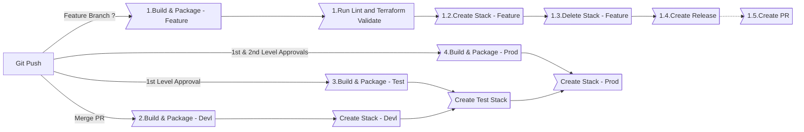
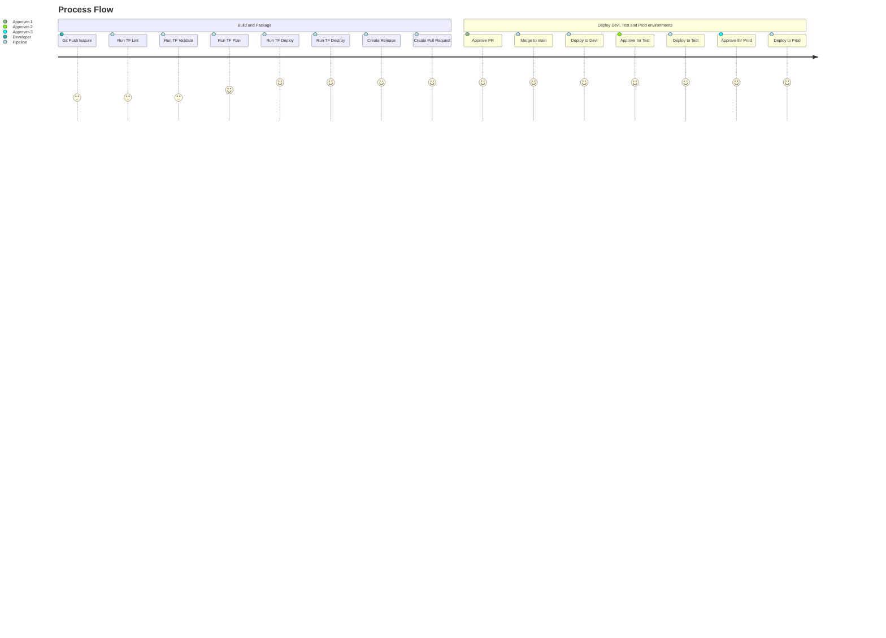
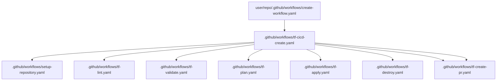
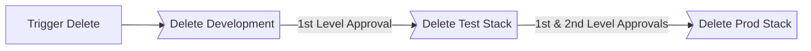
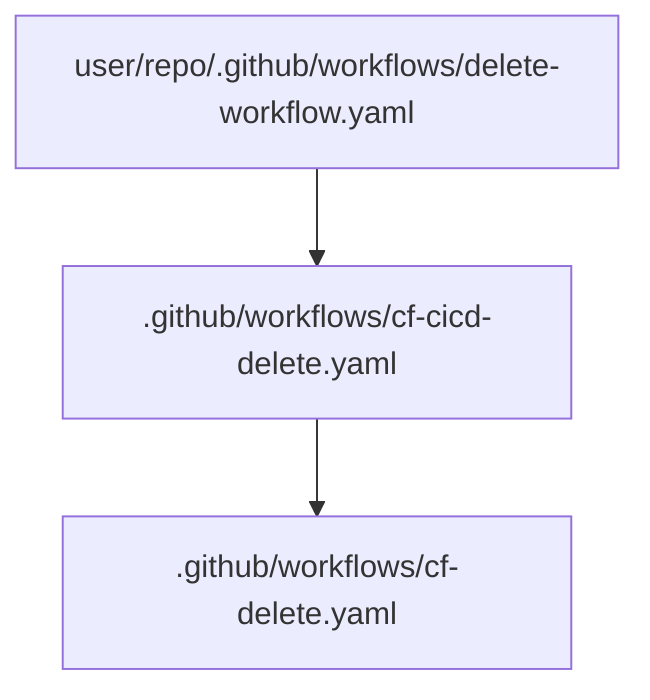

&nbsp;&nbsp;&nbsp;&nbsp;&nbsp;&nbsp;&nbsp;&nbsp;&nbsp;

## CI/CD Workflow Create and Deploy Stack

This repository provides a template for creating Terraform configurations. It includes best practices, common modules, and examples to help you get started with infrastructure as code using Terraform.

#### Flowchart





### To use the pipeline in your repository create a create-stack.yaml file in .github/workflows

###### *Plan and Deploy*
```yaml
name: "Terraform Plan and Deploy"

on:
  workflow_dispatch:
  push:
    branches:
      - main
      - 'feature**'
    paths-ignore:
      - '**/README.md'
      - '**/.github/workflows/**.yaml'


permissions:
  id-token: write # This is required for aws oidc connection
  contents: write # This is required for actions/checkout
  issues: write
  pull-requests: write # This is required for gh bot to comment PR

jobs:
  cicd:
    uses: subhamay-bhattacharyya/9999-reusable-wf/.github/workflows/tf-cicd-create.yaml@main
    with:
      deploy-reviewer-test: <User Id of the approver for deployment to test environment>
      deploy-reviewer-prod: <User Id of the approver for deployment to prod environment>
      pr-approver: <Pull Request Approvel>
    secrets:
      git-token: ${{ secrets.GIT_TOKEN }}
```

###### *Destroy*

```yaml
name: "Terraform Delete"

on:
  workflow_dispatch:

permissions:
  id-token: write # This is required for aws oidc connection
  contents: read # This is required for actions/checkout
  pull-requests: write # This is required for gh bot to comment PR

jobs:
  delete:
    uses: subhamay-bhattacharyya/9999-reusable-wf/.github/workflows/tf-cicd-destroy.yaml@main
```

###### *Infracost*
```yaml
name: "Run Infracost"

on:
  pull_request:
    types: [opened, synchronize, closed]

jobs:
  create:
    name: "run-infracost"
    uses: subhamay-bhattacharyya/9999-reusable-wf/.github/workflows/tf-infracost.yaml@main
    secrets:
      infracost-api-key: ${{ secrets.INFRACOST_API_KEY }}
```

## Reusable nested workflows



## CI/CD Workflow Delete Stack




### To use the pipeline in your repository create a delete-stack.yaml file in .github/workflows

```yaml
name: Parent CI-CD Workflow

on:
  push:

permissions:
  id-token: write       # This is required for aws oidc connection
  contents: read        # This is required for actions/checkout
  pull-requests: write  # This is required for gh bot to comment PR
  issues: write

jobs:
  cf-cicd:
    name: CI-CD
    uses: subhamay-bhattacharyya/9999-reusable-wf/.github/workflows/cf-cicd-delete.yaml@main
```

## Reusable nested workflows




## Features

- Pre-configured Terraform modules for common infrastructure components
- Examples of Terraform configurations for different environments
- Best practices for organizing and managing Terraform code
- CI/CD integration for automated testing and deployment

# Project Setup and Development Workflow

This repository outlines the process of developing and deploying infrastructure using Terraform and CI/CD pipelines. Follow the steps below to contribute and deploy code successfully.

## Development Workflow

1. **Create a New Repo from Template**
   - Use this repository as a template to create a new repo for your project.

2. **Clone the Repository**
   - Clone the repo to your local machine.
   - Add the necessary Terraform code, parameter files, and Lambda or Glue code (if any).

3. **Create and Assign Issues**
   - Create a new issue for the feature you are working on.
   - Assign the issue to a developer.
   - A feature branch will be automatically created, prefixed with the issue number (e.g., `SB-0001`) generated from a prefix and sequence number.

4. **Switch to the Feature Branch**
   - Switch your local branch from `main` to the new feature branch.

5. **Check in the Code**
   - Commit your code following the required message format: `IssuePrefix: Short Message` (e.g., `SB-0001: Add initial Terraform configuration`).
   - Pre-commit hooks will:
     - Verify the commit message format.
     - Format the Terraform code using `terraform fmt`.
     - Prevent changes from being committed directly to the `main` branch.

6. **Push the Code to Remote**
   - Push your changes to the remote repository.

## CI/CD Pipeline

1. **Pipeline Initialization**
   - The CI/CD pipeline initializes by setting up the repository environment, branch protection rules, and pull request (PR) approvers.

2. **Code Quality Checks**
   - Terraform linter and validator run in parallel to ensure code quality.

3. **Terraform Plan**
   - If linter and validator succeed, the `terraform plan` command runs to create an execution plan.

4. **Temporary Stack Deployment**
   - Deploys a temporary stack with a random suffix and the branch name.
   - Adds ARNs of the created resources, AWS account number, and region in a comment for verification.
   - Once verified, the temporary stack is deleted, and a release is created with a release tag.

5. **Pull Request Creation**
   - Creates a pull request with infrastructure cost estimates and logical resource names.

6. **PR Approval and Merge**
   - PR needs approval from designated approvers.
   - On approval, the feature branch merges with `main` and is deleted on successful merge.

## Deployment Stages

1. **Development Environment Deployment**
   - After PR approval, the stack is created in the development environment.

2. **Approval for Test and Production Deployment**
   - Deployment requires two approvals to progress from development to test and production.

3. **Sequential Deployment to Test and Production**
   - On approval, the stack deploys to the test environment first.
   - After successful deployment in test, the stack is deployed to production.

## Contribution Guidelines

- Ensure all code is checked against Terraform formatting and linter guidelines.
- Adhere to the commit message format and branch naming conventions.
- Ensure code quality by addressing any issues raised by the CI/CD pipeline.

---

Following these guidelines will help maintain code quality, streamline the review process, and ensure smooth deployments.

### Getting Started

* This repository is configured to deploy the stack in Development, Staging and Production AWS Accounts. To use the pipeline you need to have
three AWS Accounts created in an AWS Org under a Management Account (which is the best practice). The Org structure will be as follows:

```
Root
├─ Management
├─-- Development
├─-- Test
└─-- Production
```

* Create KMS Key in each of the AWS Accounts which will be used to encrypt the resources.

* Create an OpenID Connect Identity Provider

* Create an IAM Role for OIDC and use the sample Trust Policy in each of the three AWS accounts
```
{
    "Version": "2008-10-17",
    "Statement": [
        {
            "Effect": "Allow",
            "Principal": {
                "Federated": "arn:aws:iam::<Account Id>:oidc-provider/token.actions.githubusercontent.com"
            },
            "Action": "sts:AssumeRoleWithWebIdentity",
            "Condition": {
                "StringLike": {
                    "token.actions.githubusercontent.com:sub": [
                        "repo:<GitHub User>/<GitHub Repository>:ref:refs/head/main",
                    ]
                }
            }
        }
    ]
}
```


### Installing

* The repository directory structure should be as follows:
```
AWS Organization
├── Management Account
    ├── Development Account
    ├── Test Account
    └── Production Account


```
* Clone the repository.
* Create a S3 bucket to used a code repository.
* Modify the params/*.terraform.tfvars files
    * devl.terraform.tfvars -> Parameters for Devl
    * test.terraform.tfvars -> Parameters for Test
    * prod.terraform.tfvars -> Parameters for Prod

* Create the following GitHub Organization Variables and Secrets:


|Variable Name|Variable Value|
|-|-|
|AWS_REGION|```us-east-1```|
|DEVL_AWS_KMS_KEY_ARN|```arn:aws:kms:<AWS Region>:<Development Account Id>:key/<KMS Key Id in Development>```|
|TEST_AWS_KMS_KEY_ARN|```arn:aws:kms:<AWS Region>:<Test Account Id>:key/<KMS Key Id in Test>```|
|PROD_AWS_KMS_KEY_ARN|```arn:aws:kms:<AWS Region>:<Production Account Id>:key/<KMS Key Id in Production>```|
|DEVL_AWS_ROLE_ARN|```arn:aws:iam::<Development Account Id>:role/<OIDC IAM Role Name>```|
|TEST_AWS_ROLE_ARN|```arn:aws:iam::<Test Account Id>:role/<OIDC IAM Role Name>```|
|PROD_AWS_ROLE_ARN|```arn:aws:iam::<Production Account Id>:role/<OIDC IAM Role Name>```|
|DEVL_AWS_TF_STATE_BUCKET_NAME|```<Terraform State S3 Bucket in Development>```|
|TEST_AWS_TF_STATE_BUCKET_NAME|```<Terraform State S3 Bucket in Test>```|
|PROD_AWS_TF_STATE_BUCKET_NAME|```<Terraform State S3 Bucket in Production>```|

|Secret Name|Secret Value|
|-|-|
|GIT_TOKEN|```GitHub Access Token```|
|INFRACOST_API_KEY|```Infracost API Key```|

### Executing the CI/CD Pipeline

* Create Create a feature branch and push the code.
* The CI/CD pipeline will create a build and then will deploy the stack to devlopment.
* Once the Stage and Prod deployment are approved (If you have configured with protection rule ) the stack will be reployed in the respective environments

## Help

:email: Subhamay Bhattacharyya  - [subhamay.aws@gmail.com]


## Authors

Contributors names and contact info

Subhamay Bhattacharyya  - [subhamay.aws@gmail.com]

## Version History

* 0.1
    * Initial Release

## License

This project is licensed under Subhamay Bhattacharyya. All Rights Reserved.

## Acknowledgments

I would like to thank the following individuals and projects that made this work possible:

- GitOps Minicamp 2024 - I was guided by the GipOps Minicamp conducted by Derek Morgan and Andrew Brown.
- Derek Morgan (@morethancertified) - Specific contributions made by this individual, such as code reviews, testing, or feature suggestions.
- Tutorial/Documentation Source - More Than Certified tutorials by Derek Morgan ([@morethancertified](https://github.com/morethancertified)) and GitHub tutorials by Andrew Brown (https://www.exampro.co/)

Special thanks to everyone in the open-source community for their invaluable support and resources.

Feel free to add any additional acknowledgments or edit as appropriate to fit your project. This format shows gratitude to individuals or projects that supported your work directly or indirectly.